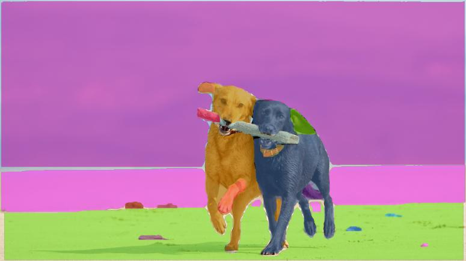
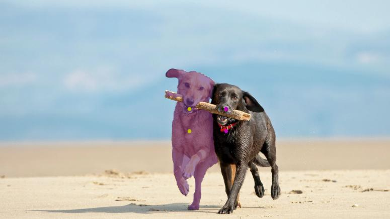
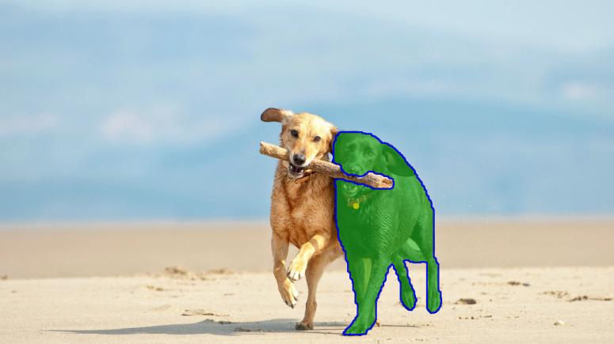
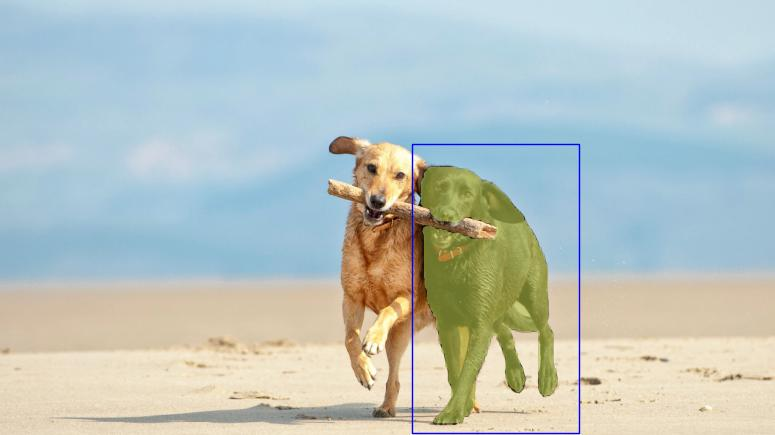
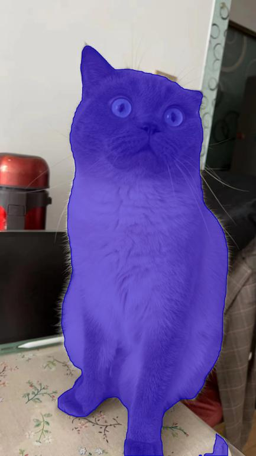

# MORE_USAGES


### Everything mode
Use --imgsz to change different input sizes.

```shell
python Inference.py --model_path ./weights/FastSAM.pt \
                    --img_path ./images/dogs.jpg \
                    --imgsz 720 \
```



### Use more points
p
```shell
python Inference.py --model_path ./weights/FastSAM.pt \
                    --img_path ./images/dogs.jpg \
                    --point_prompt "[[520,360],[620,300],[520,300],[620,360]]" \
                    --point_label "[1,0,1,0]"
```

### draw mask edge
Use `--withContours True` to draw the edge of the mask.

When `--better_quality True` is set, the edge will be more smooth.

```shell
python Inference.py --model_path ./weights/FastSAM.pt \
                    --img_path ./images/dogs.jpg \
                    --point_prompt "[[620,360]]" \
                    --point_label "[1]" \
                    --withContours True \
                    --better_quality True
```


### use box prompt
Use `--box_prompt [x,y,w,h]` to specify the bounding box of the foreground object
```shell
python Inference.py --model_path ./weights/FastSAM.pt \
                    --img_path ./images/dogs.jpg \
                    --box_prompt "[[570,200,230,400]]"
```


### use text prompt
Use `--text_prompt "text"` to specify the text prompt
```shell
python Inference.py --model_path ./weights/FastSAM.pt \
                    --img_path ./images/cat.jpg \
                    --text_prompt "cat" \
                    --better_quality True \
                    --withContours True 
```

